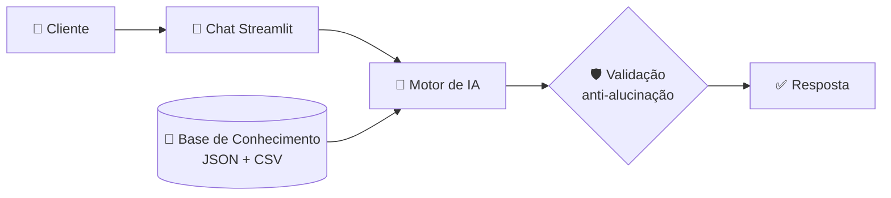

<div align="center">

# 🤖 MR. Valins
### Educador Financeiro com IA Generativa

*Finanças pessoais explicadas como um professor particular: simples, seguro e sem enrolação.*


</div>

---

## 💡 O Problema

Muita gente não sabe por onde começar a investir, como organizar os gastos ou como se preparar para a aposentadoria.

## 🎯 A Solução

O **MR. Valins** é um agente **educador**: explica conceitos financeiros em linguagem simples e usa os **dados do próprio cliente** como exemplo prático.

> 🚫 Ele **ensina, não recomenda**. Nada de "compre isto": o objetivo é você entender e decidir com segurança.

---

## ✨ O Que Ele Faz

| | |
|---|---|
| 📚 **Ensina** | CDI, Selic, ações, renda fixa e outros conceitos, com analogias fáceis |
| 🔍 **Analisa gastos** | Mostra onde o dinheiro do cliente está indo, com base nas transações |
| 🧭 **Orienta** | Sugere estratégias de organização financeira |
| ✅ **Confirma** | Sempre pergunta se o cliente entendeu |

---

## 🧠 Como Funciona



| Camada | Tecnologia |
|---|---|
| Interface | Streamlit |
| LLM | GPT-4 via API |
| Dados | JSON e CSV mockados |
| Segurança | Validação de respostas |

---

## 🛡️ Segurança e Limites

O agente **responde só com base nos dados fornecidos**, admite quando não sabe e nunca inventa informação financeira.

**Ele não:**
- ❌ recomenda investimentos
- ❌ faz previsões de mercado ou promete rentabilidade
- ❌ realiza transações pelo chat
- ❌ acessa dados bancários sensíveis
- ❌ substitui um profissional certificado

---

## 💬 Exemplo

> **Você:** Onde estou gastando mais?
>
> **MR. Valins:** Olhando suas transações de outubro, sua maior despesa é moradia, seguida de alimentação. Juntas, representam quase 80% dos seus gastos. Isso é bem comum! Quer que eu explique algumas estratégias de organização?

---

## 📁 Estrutura do Projeto

```
📦 dio-lab-bia-do-futuro
├── 📁 data/      # Base de conhecimento (transações, perfil, produtos, atendimentos)
├── 📁 docs/      # Documentação: agente, dados, prompts, métricas e pitch
├── 📁 src/       # Código da aplicação
├── 📁 assets/    # Imagens e diagramas
└── 📁 examples/  # Referências do template
```

## 📖 Documentação

| # | Documento | Conteúdo |
|---|---|---|
| 1 | [Documentação do Agente](docs/01-documentacao-agente.md) | Caso de uso, persona e arquitetura |
| 2 | [Base de Conhecimento](docs/02-base-conhecimento.md) | Estratégia de dados |
| 3 | [Prompts](docs/03-prompts.md) | System prompt, exemplos e edge cases |
| 4 | [Métricas](docs/04-metricas.md) | Avaliação de qualidade |
| 5 | [Pitch](docs/05-pitch.md) | Roteiro de apresentação |

---

## 🚀 Como Rodar

```bash
# 1. Clone o projeto
git clone https://github.com/clebiovalins/dio-lab-bia-do-futuro.git
cd dio-lab-bia-do-futuro

# 2. Instale as dependências
pip install streamlit openai

# 3. Configure sua chave de API
export OPENAI_API_KEY="sua-chave-aqui"

# 4. Execute
streamlit run src/app.py
```

---

## 🧪 Aprendizados

- Engenharia de prompt na prática: o system prompt é a base do agente.
- O mesmo prompt em **ChatGPT, Copilot e Claude** gerou respostas parecidas, mas em padrões diferentes. Nos testes de edge case (pergunta fora do escopo, como previsão do tempo), o ChatGPT foi o que mais se perdeu.

---

<div align="center">

**Desenvolvido por Clébio Valins** · Bootcamp DIO · Bia do Futuro

[](https://github.com/clebiovalins)

</div>
